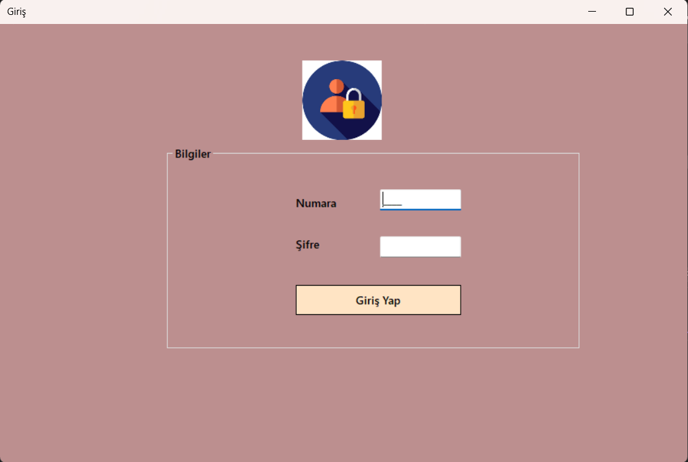

# ChatApp

Bu proje, kullanıcıların veritabanına kayıtlı numara ve şifre ile giriş yaptıktan sonra alıcı numarası, başlık ve mesaj bilgilerini girerek mesaj gönderebilmesini sağlar. Gönderilen mesajlar, her bir karakteri şifrelenerek veritabanına kaydedilir. Gelen kutusunda ise şifrelenmiş mesajlar çözülerek kullanıcı tarafından anlaşılabilir hale getirilir.

## Giriş Sayfası
Projede kullanıcıların sisteme giriş yapabileceği ekran.

## Mesaj Gönderme Sayfası
Kullanıcıların alıcı numarası, başlık ve mesaj bilgisi girerek mesaj gönderebildiği ekran.

## Giden Kutusu
Gönderilen mesajların listelendiği ekran.

## Veritabanına Kayıt Biçimi
Mesajların şifrelenmiş olarak veritabanında nasıl saklandığını gösterir.

