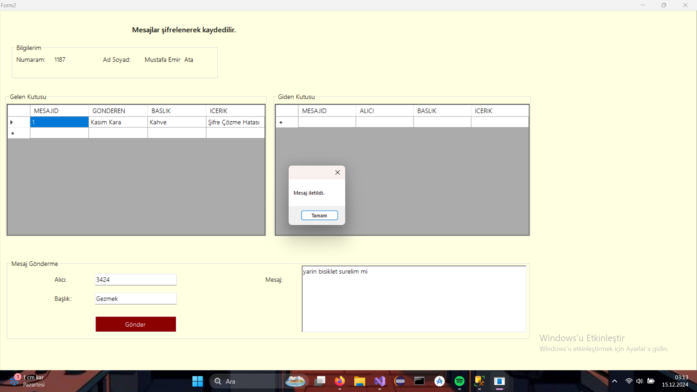
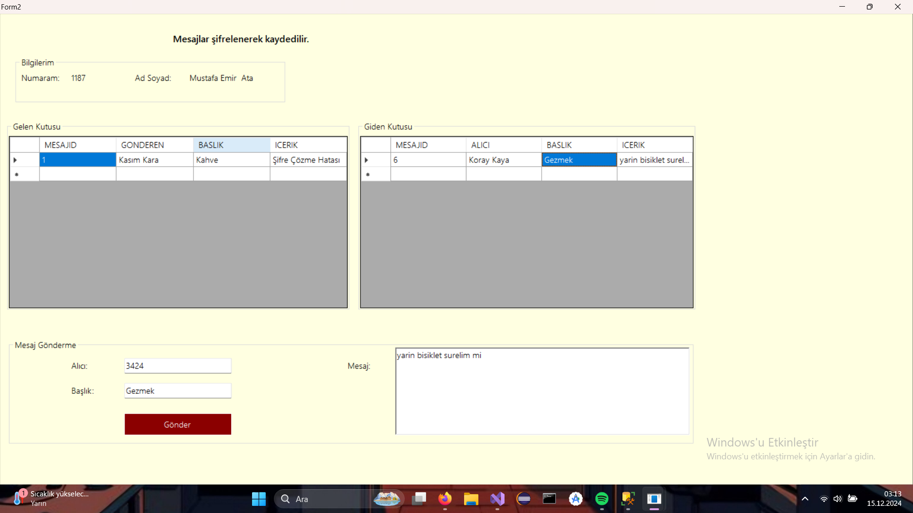
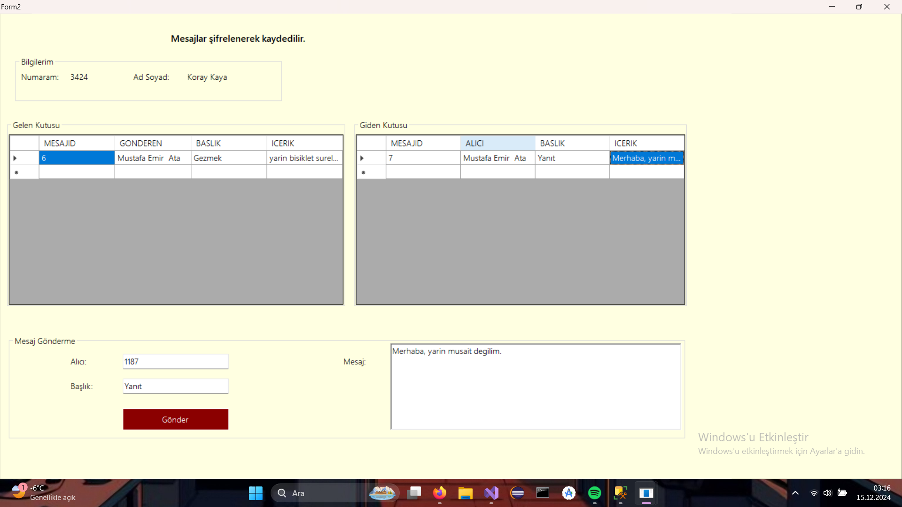
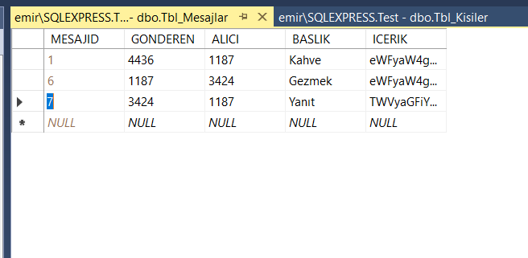

#ChatApp
##Projede veritabanına kayıtlı kullanıcı numarası ve şifresi girildikten sonra alıcı numarası, başlık ve mesaj bilgileri girerek girilen alıcı numarasına mesaj atılması hedeflendi. Ayrıcaa gönderilen mesajdaki her bir karakter şifrelenerek veritabanına kaydedildi. Aynı şekilde gelen kutusunda bu şifreler çözülerek mesajlar anlaşılabilir hale getirildi.
##Giriş Sayfası

##Mesaj Gönderme Sayfası

##Giden kişinin erişmesi

##Veri tabanına kayıt biçimi

